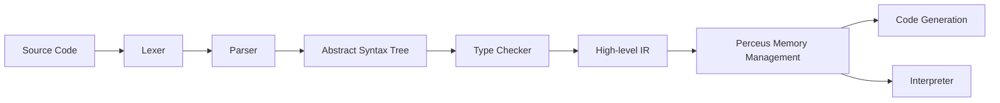

# CLAUDE.md

This file provides guidance to Claude Code (claude.ai/code) when working with code in this repository.

## Highest Priority Rule

[DESIGN_GOALS.md](DESIGN_GOALS.md) is the **supreme constitutional document** for all design and implementation decisions in the X language. If any other document (including this CLAUDE.md) conflicts with DESIGN_GOALS.md, the design goals document takes precedence. Always consult DESIGN_GOALS.md before making any design choices.

## examples Directory Rules

The `examples/` directory is maintained personally by the user. Claude must obey the following rules:

1. **No modification of user examples**: Claude must not modify, delete, or overwrite any `.x` or `.zig` files written by the user in the `examples/` directory.
2. **Guarantee compilability and runnability**: When the user writes example code in `examples/`, Claude must ensure the code can compile and run correctly. If compilation or execution fails, Claude should fix compiler/runtime issues, not modify the user's example code.
3. **Compiler modifications allowed**: If the example code exposes a compiler bug or missing feature, Claude should fix the compiler code so the example works correctly.

## Project Overview

X is a modern general-purpose programming language with natural language-style keywords (`needs`, `given`, `wait`, `when`/`is`, `can`, `atomic`), mathematical function notation, explicit effect/error types (R·E·A), and Perceus-style memory management (compile-time dup/drop, reuse analysis). It supports functional, declarative, object-oriented, and procedural programming paradigms.

**Current status**: Phase 1 is mostly complete: lexer, parser, AST, and tree-walking interpreter are implemented. Type checker, HIR, Perceus, and multiple code generation backends (Zig, LLVM, JavaScript, JVM, .NET) exist as crates with varying levels of completion. The Zig backend is the most mature and supports core language features. Official language specification is in [spec/](spec/) (see [spec/README.md](spec/README.md)).

## Build System

This project uses **Cargo** (Rust package manager). Buck2 is not used.

### Zig Compiler Dependency

The Zig backend requires Zig 0.13.0 or higher installed and in PATH. Zig is used to generate native and Wasm code, and includes LLVM backend out of the box, so no separate LLVM installation is needed for the Zig backend.

Download Zig at: https://ziglang.org/download/

Verify installation:
```bash
zig version
```

## Common Commands

```bash
# Build the CLI
cd tools/x-cli && cargo build
cd tools/x-cli && cargo build --release

# Run a .x file (parse + interpret)
cd tools/x-cli && cargo run -- run <file.x>

# Check syntax and types
cd tools/x-cli && cargo run -- check <file.x>

# Compile: full pipeline; --emit for debugging
cd tools/x-cli && cargo run -- compile <file.x> [-o output] [--emit tokens|ast|hir|pir|zig] [--no-link]
# Using Zig backend (most mature): generates Zig code and compiles to executable or Wasm
cd tools/x-cli && cargo run -- compile hello.x -o hello

# Run all compiler unit tests
cd compiler && cargo test

# Run a single test
cd compiler && cargo test -p <crate> <test_name>
# Example: run parser test
cd compiler && cargo test -p x-parser parse_function

# Run specification tests
cargo run -p x-spec
# Or: ./test.sh (runs both unit tests and spec tests)

# Run examples
cd tools/x-cli && cargo run -- run ../../examples/hello.x
cd tools/x-cli && cargo run -- run ../../examples/fib.x

# Build and run benchmarks (recommended with Zig backend)
cd examples && ./build_benchmarks.sh --backend zig && cd ..

# Format code
cargo fmt
```

## Architecture

The compiler pipeline (current and target):



X compiler uses a classic three-stage architecture: **Frontend → Middle End → Backend**.

| Stage      | Process               | IR / Output         | Crate Location              |
|------------|-----------------------|---------------------|-----------------------------|
| 1          | Lexical analysis      | Token stream        | `compiler/x-lexer`          |
| 2          | Syntax analysis       | AST                 | `compiler/x-parser`         |
| 3          | Type checking         | Typed AST/HIR       | `compiler/x-typechecker`    |
| 4          | HIR generation        | HIR (high-level IR) | `compiler/x-hir`            |
| 5          | MIR generation        | MIR (mid-level IR)  | `compiler/x-mir`            |
| 6          | Perceus analysis      | dup/drop/reuse      | `compiler/x-mir` (formerly `x-perceus`) |
| 7          | LIR generation        | LIR (low-level IR)  | `compiler/x-lir`            |
| 8          | Code generation       | Multiple backends   | `compiler/x-codegen`        |
| (Alternative)| Interpret execution | Run directly from AST | `compiler/x-interpreter`  |
| CLI        | Command-line interface | Executable       | `tools/x-cli`               |

### IR Hierarchy

```
AST (Abstract Syntax Tree)
  ↓ Lowering
HIR (High-level IR)
  ↓ Lowering
MIR (Mid-level IR) ← Perceus memory analysis happens here
  ↓ Lowering
LIR (Low-level IR = XIR) ← Unified input for all backends
  ↓
  Backends (Zig, C, Rust, Java, C#, TypeScript, Python, LLVM, ...)
```

### Code Generation Backends

| Backend       | Status | Description |
|---------------|--------|-------------|
| Zig           | ✅ Mature | Compiles to Zig source code, then uses Zig compiler to generate native or Wasm binaries. Most features implemented. |
| C             | 🚧 Early | Compiles to C source for maximum portability. |
| Rust          | 🚧 Early | Compiles to Rust source code for Rust ecosystem interop. |
| JavaScript/TS | 🚧 Early | Compiles to TypeScript/JavaScript for browsers/Node.js. |
| JVM           | 🚧 Early | Compiles to JVM bytecode (currently via Java source). |
| .NET          | 🚧 Early | Compiles to .NET CIL (currently via C# source). |
| Python        | 🚧 Early | Compiles to Python source. |
| Swift         | 📋 Planned | Compiles to Swift source for Apple ecosystem. |
| LLVM          | 🚧 Early | Generates LLVM IR for advanced optimizations. |
| Native        | 📋 Planned | Direct machine code generation for fast compilation. |

**Current implementation**: The CLI fully integrates the complete pipeline:
- **run**: source → parse → type check → interpret
- **check**: source → parse → type check
- **compile**: source → parse → type check → HIR → MIR → LIR → code generation → executable/object file. Use `--emit tokens|ast|hir|mir|lir|zig` to output intermediate results.

## Crate Responsibilities

| Crate           | Location | Purpose |
|-----------------|----------|---------|
| x-cli           | `tools/x-cli` | CLI binary (run, compile, check, format, package, repl). Orchestrates the compiler pipeline. |
| x-lexer         | `compiler/x-lexer` | Lexical analysis. Generates token stream from source code. Uses `logos` crate. |
| x-parser        | `compiler/x-parser` | Syntax analysis. Builds AST (program, declarations, expressions, types). |
| x-hir           | `compiler/x-hir` | High-level intermediate representation (after parsing, before type checking). |
| x-mir           | `compiler/x-mir` | Mid-level intermediate representation (control-flow graph). Perceus analysis happens here. |
| x-lir           | `compiler/x-lir` | Low-level intermediate representation (XIR) - unified input for all backends. |
| x-typechecker   | `compiler/x-typechecker` | Type checking and semantic analysis. Error types defined; logic mostly stubbed. |
| x-codegen       | `compiler/x-codegen` | Generic code generation infrastructure + multiple source-output backends (Zig, C, Rust, Java, C#, TS, Python). XIR definition. |
| x-codegen-js    | `compiler/x-codegen-js` | JavaScript backend. |
| x-codegen-jvm   | `compiler/x-codegen-jvm` | JVM bytecode backend. |
| x-codegen-dotnet | `compiler/x-codegen-dotnet` | .NET CIL backend. |
| x-interpreter   | `compiler/x-interpreter` | AST-based tree-walking interpreter. Used by the `run` command. |
| x-stdlib        | `library/stdlib` | Minimal standard library: Option, Result and other core language types. |
| x-spec          | `spec/x-spec` | Specification test runner. TOML test cases, optionally linked to spec sections. |

## Testing

- **Unit tests**: In `#[cfg(test)]` modules in each crate. Run with `cd compiler && cargo test`.
- **Specification tests**: Located in `spec/x-spec`. TOML test cases contain `source`, `exit_code`, `compile_fail`, `error_contains`, and optionally `spec = ["section"]` linking to spec chapters. Run with `cargo run -p x-spec` or `./test.sh`.
- **Benchmarks**: Located in `examples/`. Run with `build_benchmarks.sh` to test code generation backends against expected output.

When adding language features, add or update specification tests linked to the corresponding spec chapters.

## Implementation Steps for Adding/Modifying Language Features

Follow this order when adding or modifying language features:

1. **Update specification**: Update [spec/](spec/) (see [spec/README.md](spec/README.md)) and/or [docs/](docs/) as needed (lexer, types, expressions, functions, etc.).
2. **Update x-lexer**: If new tokens or comment syntax are needed.
3. **Update x-parser**: Support new syntax (grammar rules and AST nodes).
4. **Update x-hir**: If the change introduces new IR structures.
5. **Update x-typechecker**: Implement type rules and semantic checks.
6. **Update x-codegen or x-interpreter**: Implement code generation or execution behavior. Prioritize Zig backend for new features.
7. **Add or update specification tests**: Add tests in `spec/x-spec`, use `spec = ["section"]` to point to corresponding spec chapters.

## Code Style and Logging

- Use standard Rust style, run `cargo fmt` to format.
- Prefer `log` for compiler diagnostics (`tracing` is also acceptable). Use `log::debug!` for stage-internal details; avoid `println!` in library code to allow log level control with `RUST_LOG=debug`.
- When adding a new processing stage, consider outputting one high-level log (e.g., "lexical analysis complete", "type checking complete") with key metrics.

## Version Control

This project defaults to using **Jujutsu (jj)** for version control. Issue tracking can stay on GitHub (or existing workflow). Git is supported as an alternative.

Local configuration (in `.claude/CLAUDE.md`):
- Use `jj` commands instead of `git` commands
- Commit: `jj commit -m "message"`
- Push: `jj git push`
- Fetch: `jj git fetch`

## License

This project is multi-licensed open source. You can use it under any one of:
- MIT License
- Apache License 2.0
- BSD 3-Clause License

See [LICENSES.md](LICENSES.md) for full terms.

## Quick Reference

- **Specification**: [spec/](spec/) - Complete language specification ([spec/README.md](spec/README.md) is the table of contents)
- **Run**: `cd tools/x-cli && cargo run -- run <file.x>` - Run .x file (parse + interpret)
- **Check**: `cd tools/x-cli && cargo run -- check <file.x>` - Check syntax and types
- **Output tokens/AST**: `cd tools/x-cli && cargo run -- compile <file.x> --emit tokens` or `--emit ast` - Output intermediate representations
- **Testing**:
  - All unit tests: `cd compiler && cargo test`
  - Spec tests: `cargo run -p x-spec` or `./test.sh`
  - Single test: `cd compiler && cargo test -p <crate> <test_name>` e.g., `cargo test -p x-parser parse_function`
- **Examples**: See example programs in `examples/` directory, such as `hello.x`, `fib.x`
- **Errors**: Parse/syntax errors output `file:line:col` with source code snippets
