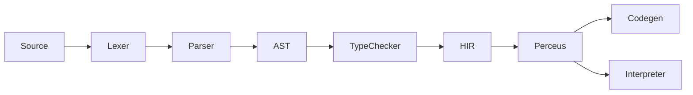

# CLAUDE.md

This file provides guidance when working with the X language (x-lang) codebase. Language semantics and syntax are defined in [README.md](README.md) (X语言规格说明书).

## Project Overview

X language is a modern programming language with natural-language-style keywords (`needs`, `given`, `wait`, `when`/`is`, `can`, `atomic`), mathematical function notation, explicit effect/error types (R·E·A), and Perceus-style memory management (compile-time dup/drop, reuse analysis). It supports functional, declarative, OOP, and procedural paradigms.

**Current phase**: Phase 1 largely done: Lexer, Parser, AST, and tree-walk Interpreter. Type checker, HIR, Perceus, and LLVM codegen exist as crates but are stubs or partial. The canonical language specification is [README.md](README.md).

## Build System

This project uses **Cargo** (Rust). No Buck2.

**LLVM 21**：x-codegen 使用 inkwell 0.8 的 `llvm21-1` 特性。若本机已安装 LLVM 21 但装在非标准路径，编译前请设置环境变量后再 `cargo build`：

```bash
# Windows（PowerShell），路径改为你的 LLVM 安装目录
$env:LLVM_SYS_211_PREFIX = "C:\Program Files\LLVM"

# Windows（cmd）
set LLVM_SYS_211_PREFIX=C:\Program Files\LLVM

# Linux / macOS
export LLVM_SYS_211_PREFIX=/usr  # 或你的 LLVM 前缀，如 /opt/llvm-21
```

不编译 x-codegen 时（如只跑 `x run` 或 `cargo test -p x-lexer -p x-parser ...`）无需安装 LLVM。

### Common Commands

```bash
# Build
cargo build
cargo build --release

# Run a .x file (parse + interpret)
cargo run -- run <file.x>

# Check syntax and types
cargo run -- check <file.x>

# Compile: full pipeline; --emit for debugging
cargo run -- compile <file.x> [-o output] [--emit tokens|ast|hir|pir|llvm-ir] [--no-link]
# With codegen feature (needs LLVM 21): generates .o/.obj and optionally links
cargo build --features codegen && cargo run --features codegen -- compile <file.x> -o out

# Run all unit tests
cargo test

# Run spec tests (after x-spec is added)
cargo run -p x-spec
# or: ./test.sh
```

## Architecture

The compiler pipeline (current and target) is:



| Stage       | Pass         | IR / Output     | Crate           |
|------------|--------------|-----------------|-----------------|
| 1          | Lexer        | tokens          | x-lexer         |
| 2          | Parser       | AST             | x-parser        |
| 3          | TypeChecker  | (typed AST/HIR) | x-typechecker   |
| 4          | HIR          | HIR (untyped)   | x-hir           |
| 5          | Perceus      | dup/drop/reuse  | x-perceus       |
| 6          | Codegen      | LLVM IR / binary| x-codegen       |
| (alternate)| Interpreter  | run from AST    | x-interpreter   |

**Current reality**: The full pipeline is wired in the CLI:
- **run**: Source → Parse → TypeCheck → Interpreter
- **check**: Source → Parse → TypeCheck
- **compile**: Source → Parse → TypeCheck → HIR → Perceus → (optional) Codegen → object file / LLVM IR. Use `--emit tokens|ast|hir|pir|llvm-ir` to dump intermediate stages. Generating object files or executables requires building with `--features codegen` and LLVM 21.

## Crate Responsibilities

| Crate           | Purpose |
|-----------------|---------|
| x-cli           | CLI binary (run, compile, check, format, package, repl). Orchestrates pipeline. |
| x-lexer         | Tokenization. Produces token stream from source. |
| x-parser        | Parsing. Builds AST (Program, declarations, expressions, types). |
| x-hir           | High-level IR (post-parse, pre-typing). Currently a stub. |
| x-typechecker   | Type checking and semantic analysis. Error types defined; logic mostly stub. |
| x-perceus       | Perceus-style analysis (dup/drop, reuse). Present; integration TBD. |
| x-codegen       | Code generation (e.g. LLVM via inkwell). Present; integration TBD. |
| x-interpreter   | Tree-walk interpreter over AST. Used by `run`. |
| x-stdlib        | Standard library definitions. |
| x-spec          | Specification test runner. TOML cases with optional README section refs. |

Rue equivalents (for reference only): rue-lexer, rue-parser, rue-rir (≈ x-hir), rue-air (typed IR), rue-cfg, rue-codegen, rue-linker, rue-spec.

## Testing

- **Unit tests**: In each crate under `#[cfg(test)]`. Run with `cargo test`. (Note: full `cargo test` builds x-codegen which requires LLVM; without LLVM use `cargo test -p x-lexer -p x-parser -p x-typechecker -p x-hir -p x-perceus -p x-interpreter`.)
- **Spec tests**: In `crates/x-spec`. TOML cases with `source`, `exit_code`, `compile_fail`, `error_contains`, and optional `spec = ["README section"]` for traceability to [README.md](README.md). Run with `cargo run -p x-spec` or a top-level `test.sh` if added.
- **UI tests** (optional, later): For diagnostics, warnings, and error message wording; can live in a separate crate or directory.

When adding a language feature, add or update spec tests that reference the relevant README section.

## Path to industrial-grade（工业级路线图）

当前实现是「可用的原型」；要接近工业级编译器，需补齐以下能力（按优先级排序）：

1. **诊断与位置**
   - ✅ **已做**：词法/解析错误带源码位置（`Span`、`file:line:col`、snippet）。见 `x-lexer/span.rs`、`ParseError::SyntaxError { message, span }`、CLI 的 `format_parse_error`。
   - 待做：类型检查错误、运行时错误也带 span；多错误收集与恢复（parser 可尝试继续解析并报告多条错误）。

2. **类型检查**
   - 现状：`x-typechecker::type_check` 为桩，直接返回 `Ok(())`。
   - 待做：按 README 类型系统实现约束检查、函数签名、未定义变量/类型等；错误类型带 span。

3. **测试与规格**
   - 现状：x-spec 有 TOML 用例，可跑 `cargo run -p x-spec`。
   - 待做：为已实现语法/语义补全用例；`run`/`check` 的回归测试；错误消息的 UI/snapshot 测试。

4. **语言与实现对齐**
   - README 定义了完整语法与类型系统，当前仅实现子集（`fun`/`val`/`var`、`if`/`return`、二元运算、`print` 等）。
   - 待做：按「Modifying the Language」顺序，逐项实现并同步 README；新特性用 x-spec 的 `spec = ["章节"]` 追溯。

5. **性能与规模**
   - 待做：大文件/大 AST 下的内存与耗时；必要时增量解析、LSP 友好接口。

6. **工具链**
   - 待做：LSP（hover、跳转、诊断）、格式化器实现、包管理与多文件编译。

实现新特性时优先考虑：**错误带位置**、**规格/测试可追溯**、**与 README 一致**。

## Modifying the Language / Implementation Steps

When adding or changing language features, follow this order:

1. **Update the specification** in [README.md](README.md) (relevant sections: lexical, types, expressions, functions, etc.).
2. **Update x-lexer** if new tokens or comment syntax are needed (e.g. `--` single-line, `{- -}` multi-line per README).
3. **Update x-parser** for new syntax (grammar and AST nodes).
4. **Update x-hir** if the change introduces new IR constructs.
5. **Update x-typechecker** for type rules and semantic checks. Optionally gate new features behind a `--preview <name>` flag (Rue-style).
6. **Update x-codegen or x-interpreter** for code generation or execution behavior.
7. **Add or update spec tests** in `crates/x-spec` with `spec = ["section"]` pointing to README.

Optional: For large or experimental features, add a preview flag in the typechecker or CLI and require `--preview feature_name` until the feature is stable.

## Code Style and Logging

- Use standard Rust style and `cargo fmt`.
- Prefer `log` (or `tracing` if adopted) for compiler diagnostics. Use `log::debug!` for pass-internal details; avoid `println!` in library code so that `RUST_LOG=debug` controls verbosity.
- When adding new passes, consider one high-level log line per pass (e.g. "lexing complete", "typecheck complete") with key metrics.

## Version Control

This project uses **Git**. Issue tracking can stay on GitHub (or existing workflow). No Jujutsu (jj) or bd (beads) requirement.

## Quick Reference

- **Spec**: [README.md](README.md)
- **Run**: `cargo run -- run <file.x>`
- **Check**: `cargo run -- check <file.x>`
- **Emit tokens/AST**: `cargo run -- compile <file.x> --emit tokens` or `--emit ast`
- **Tests**: `cargo test`; spec: `cargo run -p x-spec`
- **Errors**: 解析/语法错误会输出 `file:line:col` 与源码片段（见 Path to industrial-grade）。
