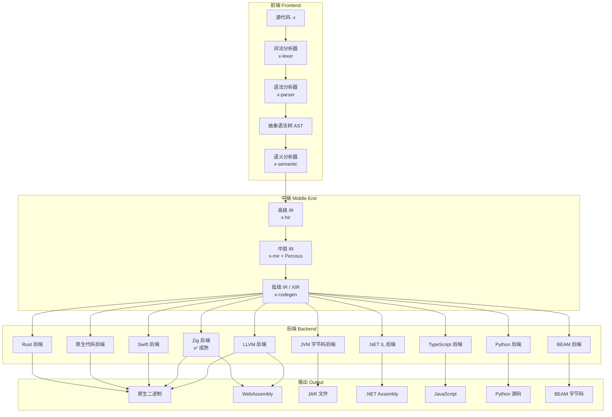

# X 语言编译器架构

> 本文描述 X 语言编译器的完整架构设计，涵盖前端、中端和十大后端。

## 概述

X 编译器采用经典的三阶段架构：**前端（Frontend）**、**中端（Middle End）**、**后端（Backend）**。前端负责语言特定的分析与转换，中端进行平台无关的优化，后端针对各目标平台生成代码。

```
┌─────────────────────────────────────────────────────────────────────────────┐
│                              X 编译器架构                                    │
├────────────────┬─────────────────────────┬─────────────────────────────────┤
│     前端       │         中端            │            后端                  │
│   Frontend     │      Middle End         │           Backend               │
├────────────────┼─────────────────────────┼─────────────────────────────────┤
│  词法分析      │   HIR (高级 IR)         │   LLVM 后端                     │
│  语法分析      │   MIR (中层 IR)         │   TypeScript 后端               │
│  语义分析      │   LIR (低级 IR) = XIR   │   JVM 字节码后端                │
│  → AST         │   (Perceus 在 MIR 阶段) │   Python 后端                   │
│                │                         │   BEAM 后端                     │
│                │                         │   Zig 后端                      │
│                │                         │   .NET IL 后端                  │
│                │                         │   Swift 后端                    │
│                │                         │   原生代码后端 (自托管)         │
│                │                         │   Rust 后端                     │
└────────────────┴─────────────────────────┴─────────────────────────────────┘
```

---

## 一、前端（Frontend）

前端负责将源代码转换为抽象语法树（AST），并进行语义分析。

### 1.1 词法分析（Lexical Analysis）

**位置**：`compiler/x-lexer`

词法分析器将源代码字符流转换为令牌（Token）流。

```
源代码: let x = 42 + 10
            ↓
令牌流: [Let] [Ident("x")] [Eq] [Integer(42)] [Plus] [Integer(10)]
```

**主要职责**：
- 识别关键字、标识符、字面量、运算符、分隔符
- 过滤空白和注释
- 记录令牌位置信息（行号、列号），用于错误报告

**实现要点**：
- 使用 `logos` 库实现高效词法分析
- 支持完整的 Unicode 标识符
- 提供详细的错误位置信息

### 1.2 语法分析（Syntax Analysis）

**位置**：`compiler/x-parser`

语法分析器根据语法规则，将令牌流构建为抽象语法树（AST）。

```
令牌流: [Let] [Ident("x")] [Eq] [Integer(42)] [Plus] [Integer(10)]
            ↓
AST:
    VariableDeclaration
    ├── name: "x"
    └── initializer:
            BinaryExpression
            ├── operator: Plus
            ├── left: IntegerLiteral(42)
            └── right: IntegerLiteral(10)
```

**主要职责**：
- 构建表达式树和声明节点
- 处理运算符优先级和结合性
- 支持多种声明：函数、变量、类型、模块
- 支持多种表达式：算术、逻辑、调用、匹配、管道等

**AST 节点类型**：
- 声明：`FunctionDecl`、`VariableDecl`、`RecordDecl`、`EnumDecl`、`ClassDecl`、`InterfaceDecl`
- 表达式：`BinaryExpr`、`UnaryExpr`、`CallExpr`、`MatchExpr`、`LambdaExpr`、`PipeExpr`
- 语句：`IfStmt`、`WhileStmt`、`ForStmt`、`ReturnStmt`、`BlockStmt`
- 类型：`NamedType`、`GenericType`、`FunctionType`、`TupleType`

### 1.3 语义分析（Semantic Analysis）

**位置**：`compiler/x-semantic`

语义分析器对 AST 进行类型检查和语义验证。

```
AST (无类型)
     ↓
类型检查、作用域解析、效果推断
     ↓
Typed AST (带类型标注)
```

**主要职责**：
- **类型推断**：基于 Hindley-Milner 算法进行全局类型推断
- **类型检查**：验证表达式类型、函数签名、接口实现
- **作用域解析**：解析标识符绑定、处理遮蔽规则
- **效果推断**：推断函数的副作用（IO、Async、Throws 等）
- **错误收集**：收集并报告多个语义错误

**类型系统特性**：
- 代数数据类型（ADT）：`enum`（sum type）+ `record`（product type）
- 参数多态：泛型函数与泛型类型
- 高阶类型：类型构造器、类型类
- 子类型：用于结构化类型和效果系统

---

## 二、中端（Middle End）

中端负责平台无关的优化和转换，生成多层中间表示（IR）。

### 2.1 中间表示层次

```
AST (抽象语法树)
     ↓ Lowering
HIR (高级中间表示)
     ↓ Lowering
MIR (中层中间表示) ← Perceus 内存分析
     ↓ Lowering
LIR (低级中间表示) = XIR
     ↓
    各后端
```

中端由三层 IR 组成：**HIR → MIR → LIR**。LIR 即是后端的统一输入（XIR），Perceus 内存分析在 MIR 阶段进行。

### 2.2 HIR - 高级中间表示

**位置**：`compiler/x-hir`

HIR 是 AST 的简化版本，保留了高级语义结构，但去除了语法糖。

**特点**：
- 显式类型标注（由语义分析器填充）
- 解析后的模式匹配（非原始语法）
- 统一的函数表示（lambda 提升）
- 模块级别的组织结构

**HIR 节点示例**：
```rust
pub struct Function {
    pub name: String,
    pub type_params: Vec<TypeParam>,
    pub params: Vec<Param>,
    pub return_type: Type,
    pub body: Block,
    pub effects: Vec<Effect>,
}

pub struct Match {
    pub scrutinee: Expr,
    pub arms: Vec<MatchArm>,
    pub is_exhaustive: bool,
}
```

### 2.3 MIR - 中层中间表示

**位置**：`compiler/x-mir`

MIR 是控制流图（CFG）形式的表示，适合进行控制流分析和数据流分析。**Perceus 内存分析在此阶段进行**。

**特点**：
- 基本块（Basic Block）组织
- 三地址码（Three-Address Code）
- 显式控制流边
- SSA 形式（静态单赋值）
- **Perceus 分析**：引用计数推断与 dup/drop 插入

**MIR 指令示例**：
```rust
pub enum Instruction {
    Assign { dest: Local, value: Operand },
    BinaryOp { dest: Local, op: BinOp, lhs: Operand, rhs: Operand },
    Call { dest: Option<Local>, func: FuncRef, args: Vec<Operand> },
    Branch { target: BasicBlock },
    CondBranch { cond: Operand, then_bb: BasicBlock, else_bb: BasicBlock },
    Return { value: Option<Operand> },
    // Perceus 指令
    Dup { dest: Local, src: Operand },
    Drop { value: Operand },
    Reuse { dest: Local, src: Operand },
}
```

**MIR 阶段处理**：
1. **Perceus 内存分析**：
   - 引用计数推断：静态分析每个值的引用计数变化
   - dup/drop 插入：在正确位置插入计数操作
   - 重用分析：当引用计数为 1 时，将「创建新值」优化为「原地更新」
2. **优化 Pass**：
   - 常量传播（Constant Propagation）
   - 死代码消除（Dead Code Elimination）
   - 公共子表达式消除（CSE）
   - 循环不变量外提（Loop Invariant Code Motion）

### 2.4 LIR - 低级中间表示（XIR）

**位置**：`compiler/x-codegen/src/xir.rs`

LIR（低级中间表示）即是 XIR，作为所有后端的统一输入。

**特点**：
- 虚拟寄存器
- 内存访问显式化
- 调用约定标注
- 栈帧布局
- SSA 形式

```rust
pub struct Module {
    pub name: String,
    pub functions: Vec<Function>,
    pub globals: Vec<Global>,
    pub types: Vec<TypeDefinition>,
}

pub struct Function {
    pub name: String,
    pub signature: Signature,
    pub blocks: Vec<BasicBlock>,
    pub locals: Vec<Local>,
}

pub struct BasicBlock {
    pub label: String,
    pub instructions: Vec<Instruction>,
    pub terminator: Terminator,
}
```

---

## 三、后端（Backend）

X 编译器采用**两阶段后端架构**，基于统一的 LIR（低级中间表示）：

### 后端架构概览

**第一阶段（当前）**：十大后端 - LIR 翻译为目标语言或字节码
- **LLVM**、**TypeScript**、**Java**、**Python**、**Erlang**、**Zig**、**C#**、**Swift**、**Rust**、**Native**
- 这十个后端以统一的 LIR 为输入，分别翻译为不同的目标格式或中间语言
- 充分利用已有的编译器工具链（tsc、javac、rustc、swiftc 等）完成最终编译

**第二阶段（成熟后）**：优化与直接生成 - 绕过中间语言
- JVM 字节码直接生成（LIR → .class，跳过 Java 源码）
- .NET IL 直接生成（LIR → .dll/.exe，跳过 C# 源码）
- BEAM 字节码优化版本
- 原生代码优化版本
- 提升编译速度和输出质量

### 3.1 后端概览（第一阶段 - 十大后端）

| 后端 | 翻译目标 | 目标平台 | 成熟度 | 主要用途 |
|------|----------|----------|--------|----------|
| **LLVM** | LLVM IR | Native, Wasm | 🚧 早期 | 原生高性能、深度优化 |
| **TypeScript** | TypeScript 源码 | Node.js, 浏览器 | 🚧 早期 | Web 前端全生态 |
| **Java** | Java 源码 | JVM, Android | 🚧 早期 | 企业级、大数据、Android |
| **Python** | Python 源码 | CPython | 🚧 早期 | AI、数据科学、脚本 |
| **Erlang** | BEAM 字节码 | Erlang VM | 📋 规划 | 高并发分布式 |
| **Zig** | Zig 源码 | Native, Wasm | ✅ 成熟 | 嵌入式、增量编译、跨平台 |
| **C#** | C# 源码 | .NET, Unity | 🚧 早期 | Windows、Unity 游戏开发 |
| **Swift** | Swift 源码 | iOS, macOS | 📋 规划 | Apple 生态 |
| **Rust** | Rust 源码 | Native | 🚧 早期 | 系统编程、安全并发 |
| **Native** | 原生机器码 | x86_64, ARM64 | 📋 规划 | 快速编译、自举 |

### 3.2 后端分类（第一阶段）

```
LIR 后端架构
│
├─ 【源码翻译型】翻译为高级语言源码
│  ├── TypeScript → .ts 源码 → tsc → JavaScript
│  ├── Java       → .java 源码 → javac → JVM 字节码
│  ├── Python     → .py 源码 → CPython 解释执行
│  ├── Zig        → .zig 源码 → Zig 编译器 → Native / Wasm
│  ├── C#         → .cs 源码 → dotnet build → .NET Assembly
│  ├── Swift      → .swift 源码 → swiftc → Native
│  └── Rust       → .rs 源码 → rustc → Native
│
├─ 【中间IR翻译型】翻译为标准中间表示
│  └── LLVM       → LLVM IR → LLVM opt → Native / Wasm
│
├─ 【字节码翻译型】翻译为 VM 字节码
│  └── Erlang     → BEAM 字节码 → Erlang VM 执行
│
└─ 【原生机器码型】直接生成机器码
   └── Native     → x86_64 / ARM64 机器码 → 可执行文件

━━━━━━━━━━━━━━━━━━━━━━━━━━━━━━━━━━━━━━━━━━━━━━━
【第二阶段】优化与直接生成（规划中）
┌─────────────────────────────────────────────┐
│ LIR → 直接生成目标格式，跳过中间语言翻译  │
├─────────────────────────────────────────────┤
│ • Java 后端第二阶段：LIR → JVM 字节码     │
│ • C# 后端第二阶段：LIR → .NET IL          │
│ • Erlang 优化版本：更好的 BEAM 生成       │
│ • Native 优化版本：更好的机器码生成       │
└─────────────────────────────────────────────┘
```

### 3.3 LLVM 后端（第一阶段）

**位置**：`compiler/x-codegen-llvm`

**第一阶段**：LIR 翻译为 LLVM IR，利用 LLVM 的工业级优化能力。

```
LIR → LLVM IR → LLVM opt → Native Binary / Wasm
```

**翻译流程**：
- LIR 中的控制流、操作等结构翻译为 LLVM IR
- 利用 LLVM 的优化 Pass（常量折叠、循环优化、内联等）
- 调用 LLVM 后端生成机器码

**支持的目标平台**：
- **Native**：x86_64、ARM64、RISC-V、MIPS 等
- **WebAssembly**：Wasm32、Wasm64

**优势**：
- 工业级优化 Pass
- 多平台交叉编译
- 完善的工具链生态
- LTO（链接时优化）支持
- 利用 LLVM 的最新优化技术

**第二阶段规划**：
- 可能直接生成目标机器码，绕过 LLVM IR 层（取决于性能收益）

**编译命令**：
```bash
# 编译为原生可执行文件
x compile hello.x --backend llvm -o hello

# 编译为 WebAssembly
x compile hello.x --backend llvm --target wasm -o hello.wasm

# 指定特定架构
x compile hello.x --backend llvm --target x86_64-linux-gnu -o hello
```

### 3.4 TypeScript 后端

**位置**：`compiler/x-codegen/src/typescript_backend.rs`

TypeScript 后端将 LIR 翻译为 TypeScript 源码。

```
LIR → TypeScript 源码 → tsc → JavaScript
```

**适用场景**：
- Web 前端开发
- Node.js 后端开发
- Electron 桌面应用
- React/Vue/Angular 集成

**编译命令**：
```bash
x compile hello.x --target typescript -o hello.ts
```

### 3.6 Python 后端（第一阶段）

**位置**：`compiler/x-codegen/src/python_backend.rs`

**第一阶段**：LIR 翻译为 Python 源码，充分利用 CPython 解释器。

```
LIR → Python 源码 (.py) → CPython 解释执行
```

**翻译流程**：
- LIR 的结构和操作翻译为 Python 代码
- 利用 Python 的动态特性实现类型系统
- 直接在 CPython 上执行

**适用场景**：
- 数据科学和机器学习（NumPy、Pandas、PyTorch、TensorFlow）
- AI/ML 模型开发和训练
- 快速原型开发
- Python 生态互操作
- 科学计算

**编译命令**：
```bash
# 生成 Python 源码
x compile hello.x --target python -o hello.py

# 生成并立即执行
x compile hello.x --target python --run

# 与 Python 库集成
x compile hello.x --target python --library -o mylib.py
```

### 3.7 Erlang 后端（第一阶段）

**位置**：`compiler/x-codegen/src/erlang_backend.rs`（规划中）

**第一阶段**：LIR 翻译为 BEAM 字节码，运行于 Erlang 虚拟机。

```
LIR → BEAM 字节码 (.beam) → Erlang VM 执行
```

**翻译流程**：
- LIR 的并发和消息传递概念映射到 BEAM Actor 模型
- 控制流翻译为 BEAM 指令序列
- 直接生成或通过 Erlang 编译器生成 .beam 字节码

**BEAM VM 特性**：
- **Actor 模型**：轻量级进程（百万级别），天然并发
- **容错机制**：Let it crash 哲学，监督树（Supervisor Trees）
- **热更新**：运行时代码热替换（Code reloading）
- **分布式**：原生分布式支持，节点间通信

**第二阶段规划**：
- 优化 BEAM 字节码生成，提升运行时性能

**适用场景**：
- 高并发服务器（电信、实时通讯）
- 即时通讯系统（WhatsApp、Discord 核心）
- 物联网平台
- 分布式系统和集群
- 容错性要求高的系统

**编译命令**：
```bash
# 编译为 BEAM 字节码
x compile hello.x --target erlang -o hello.beam

# 生成 Erlang 源码（用于调试）
x compile hello.x --target erlang --emit-source -o hello.erl

# 运行在 Erlang 节点
x compile hello.x --target erlang --run
```

### 3.8 Zig 后端 ✅（第一阶段）

**位置**：`compiler/x-codegen/src/zig_backend.rs`

**第一阶段**：LIR 翻译为 Zig 源码，利用 Zig 编译器的强大能力。

```
LIR → Zig 源码 (.zig) → Zig 编译器 → Native Binary / Wasm
```

**翻译流程**：
- LIR 结构和操作映射到 Zig 语法
- 利用 Zig 的内存管理和类型系统
- 调用 Zig 编译器完成最终编译

**优势**：
- Zig 自带完整 LLVM 后端
- 支持无缝交叉编译
- 无运行时依赖
- 优秀的 WebAssembly 支持
- 增量编译支持
- 简洁的 C FFI 接口
- 当前最成熟的 X 后端 ✅

**适用场景**：
- 嵌入式开发（MCU、嵌入式 Linux）
- 跨平台系统编程
- 需要增量编译的项目
- C 互操作性要求高的项目
- WebAssembly 应用

**编译命令**：
```bash
# 编译为原生可执行文件
x compile hello.x -o hello

# 编译为 WebAssembly
x compile hello.x --target wasm -o hello.wasm

# 交叉编译到特定平台
x compile hello.x --target arm-linux -o hello

# 只生成 Zig 源码
x compile hello.x --emit-source -o hello.zig
```

### 3.9 C# 后端（第一阶段）

**位置**：`compiler/x-codegen/src/csharp_backend.rs`

**第一阶段**：LIR 翻译为 C# 源码，利用 .NET 编译器。

```
LIR → C# 源码 (.cs) → dotnet build → .NET Assembly (.dll/.exe)
```

**翻译流程**：
- LIR 映射到 C# 的类、方法和语句
- 利用 C# 的强类型系统
- 调用 dotnet 工具链生成程序集

**第二阶段规划**：
- 直接生成 CIL（Common Intermediate Language）字节码，绕过 C# 源码层
- 提升编译速度和输出质量

**适用场景**：
- Windows 平台开发
- .NET 生态系统（ASP.NET Core、WPF、Windows Forms）
- MAUI 跨平台应用
- Unity 游戏开发（C# 脚本）
- Azure 云服务
- Xamarin 移动应用

**编译命令**：
```bash
# 编译为 .NET 程序集（DLL）
x compile hello.x --target csharp -o hello.dll

# 编译为可执行文件（EXE）
x compile hello.x --target csharp --console -o hello.exe

# 生成 C# 源码
x compile hello.x --target csharp --emit-source -o hello.cs

# 用于 Unity
x compile hello.x --target csharp --unity -o HelloScript.cs
```

### 3.10 Swift 后端（第一阶段）

**位置**：`compiler/x-codegen/src/swift_backend.rs`（规划中）

**第一阶段**：LIR 翻译为 Swift 源码，利用 Swift 编译器。

```
LIR → Swift 源码 (.swift) → swiftc → Native Binary
```

**翻译流程**：
- LIR 映射到 Swift 的结构、类和方法
- 利用 Swift 的类型系统和内存管理
- 调用 swiftc 编译器生成二进制文件

**适用场景**：
- iOS/iPadOS 应用开发
- macOS 应用开发
- watchOS 和 tvOS 应用
- Apple 生态系统全覆盖
- SwiftUI 框架集成

**编译命令**：
```bash
# 编译为 iOS 应用
x compile hello.x --target swift --platform ios -o hello.app

# 编译为 macOS 应用
x compile hello.x --target swift --platform macos -o hello.app

# 生成 Swift 源码
x compile hello.x --target swift --emit-source -o hello.swift
```

### 3.11 Rust 后端（第一阶段）

**位置**：`compiler/x-codegen/src/rust_backend.rs`

**第一阶段**：LIR 翻译为 Rust 源码，利用 Rust 编译器。

```
LIR → Rust 源码 (.rs) → rustc → Native Binary
```

**翻译流程**：
- LIR 映射到 Rust 的所有权系统和类型
- 利用 Rust 的内存安全保证
- 调用 rustc 编译器生成二进制文件

**优势**：
- 与 Rust 生态互操作
- 充分利用 Rust 的内存安全特性
- 支持 Rust 的所有目标平台
- 可集成 Rust crate

**适用场景**：
- 与 Rust 生态互操作
- 需要内存安全保证的场景
- 系统编程
- 安全的并发编程
- WebAssembly（通过 Rust 工具链）

**编译命令**：
```bash
# 编译为可执行文件
x compile hello.x --target rust -o hello

# 生成 Rust 源码库
x compile hello.x --target rust --library -o mylib.rs

# 交叉编译
x compile hello.x --target rust --target-triple wasm32-unknown-unknown -o hello.wasm
```

### 3.12 Native 后端（第一阶段）

**位置**：`compiler/x-codegen-native`（规划中）

**第一阶段**：LIR 直接生成原生机器码，无需外部编译器。

```
LIR → x86_64 / ARM64 / 其他 机器码 → Native Binary
```

**设计目标**：
- **快速编译**：毫秒级编译速度，无需等待外部工具链
- **最小依赖**：无需安装 LLVM、Rust、Zig 等工具链
- **调试优先**：快速迭代开发体验
- **自举基础**：为编译器自我编译提供基础

**第二阶段规划**：
- 改进寄存器分配算法
- 更好的指令选择和调度
- 完整的优化 Pass（内联、常量折叠等）
- 更多架构支持

**实现策略**：
- 直接生成 ELF（Linux）/ Mach-O（macOS）/ PE（Windows）可执行文件
- 基础寄存器分配（线性扫描）
- 简单的指令选择
- 优先保证编译速度，而非运行时性能

**适用场景**：
- 快速开发循环
- 编译器自举
- 嵌入式和轻量级应用
- 快速原型开发

**编译命令**：
```bash
# 快速编译，用于调试（无优化）
x compile hello.x --backend native --mode fast -o hello

# 调试模式（包含符号表）
x compile hello.x --backend native --mode debug -o hello

# 发布模式（包含基础优化）
x compile hello.x --backend native --mode release -o hello
```

---

## 四、编译流水线

### 4.1 完整编译流程



### 4.2 CLI 命令

```bash
# 解释执行（开发调试）
x run hello.x

# 类型检查
x check hello.x

# 编译（默认 Zig 后端）
x compile hello.x -o hello

# 选择后端
x compile hello.x --backend llvm -o hello
x compile hello.x --backend zig -o hello
x compile hello.x --backend jvm -o hello.jar
x compile hello.x --backend dotnet -o hello.dll
x compile hello.x --backend python -o hello.py
x compile hello.x --backend typescript -o hello.ts
x compile hello.x --backend beam -o hello.beam
x compile hello.x --backend swift -o hello
x compile hello.x --backend native -o hello  # 原生代码后端
x compile hello.x --backend rust -o hello

# 选择目标平台
x compile hello.x --target wasm -o hello.wasm
x compile hello.x --target jvm -o hello.jar
x compile hello.x --target dotnet -o hello.dll

# 输出中间表示（调试）
x compile hello.x --emit tokens
x compile hello.x --emit ast
x compile hello.x --emit hir
x compile hello.x --emit mir
x compile hello.x --emit lir
```

---

## 五、Crate 组织

```
x-lang/
├── compiler/
│   ├── x-lexer/              # 词法分析器
│   ├── x-parser/             # 语法分析器
│   ├── x-semantic/        # 语义分析器
│   ├── x-hir/                # 高级 IR
│   ├── x-mir/                # 中层 IR + Perceus 内存管理 ✨ 新增
│   ├── x-lir/                # 低级 IR (= XIR) ✨ 新增
│   ├── x-codegen/            # 代码生成基础设施 + 后端实现
│   ├── x-codegen-llvm/       # LLVM 后端
│   ├── x-codegen-beam/       # BEAM 后端 (规划)
│   ├── x-codegen-native/     # 原生代码后端 (规划)
│   ├── x-interpreter/        # 树遍历解释器
│   └── x-stdlib/             # 标准库
│
├── tools/
│   ├── x-cli/                # 命令行工具
│   └── x-lsp/                # LSP 服务器
│
├── library/
│   └── stdlib/               # 标准库 (Option, Result, Prelude)
│
└── spec/
    └── x-spec/               # 规格测试
```

### Crate 依赖关系

```
x-lexer
    ↓
x-parser
    ↓
x-semantic
    ↓
x-hir
    ↓
x-mir (包含 Perceus 内存分析)
    ↓
x-lir (= XIR，后端统一输入)
    ↓
x-codegen → 各后端 (LLVM, TypeScript, JVM, Python, BEAM, Zig, .NET, Swift, Native, Rust)
```

---

## 六、实现路线

### 阶段一：核心能力（当前）

- [x] 词法分析器
- [x] 语法分析器
- [x] AST 定义
- [x] 树遍历解释器
- [x] Zig 后端（最成熟）
- [x] x-mir crate 创建 ✨ 新增
- [x] x-lir crate 创建 ✨ 新增
- [ ] 语义分析器（完善中）
- [ ] HIR 生成

### 阶段二：中端完善

- [ ] HIR → MIR 降级
- [ ] MIR 优化 Pass
- [ ] Perceus 内存分析（在 MIR 阶段）
- [ ] MIR → LIR 降级
- [ ] 迁移 x-perceus 到 x-mir（向后兼容）

### 阶段三：后端扩展

- [ ] BEAM 后端
- [ ] Rust 后端完善
- [ ] Swift 后端
- [ ] 原生代码后端（自托管）

### 阶段四：字节码直接生成

- [ ] JVM 字节码后端：直接生成 JVM 字节码
- [ ] .NET IL 后端：直接生成 CIL 字节码

---

## 七、设计原则

### 7.1 统一 IR 层

LIR（XIR）作为所有后端的公共输入，实现：
- **优化共享**：中端优化一次，所有后端受益
- **后端可插拔**：新增后端只需实现 LIR → 目标格式
- **增量编译**：模块级别的独立编译

### 7.2 渐进式成熟度

- **阶段一**：源码翻译，利用现有编译器
- **阶段二**：字节码直接生成，提升性能

### 7.3 多目标支持

- **Native**：原生性能，系统编程（LLVM、Zig、Rust、原生代码）
- **Wasm**：Web 和边缘计算（LLVM、Zig）
- **JVM/.NET**：企业级生态（JVM 字节码、.NET IL）
- **Python/TypeScript**：快速开发，生态互操作
- **BEAM**：高并发分布式系统

### 7.4 编译速度优先

- 原生代码后端：快速编译
- 增量编译：仅重编译修改部分
- 并行编译：模块间并行

---

*X 语言编译器架构 · 2026*
