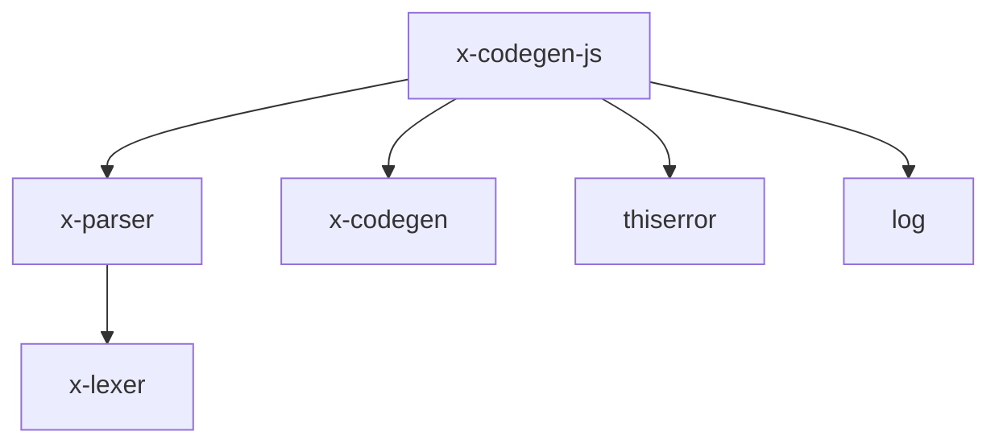

# CLAUDE.md

## 1. 功能定位

x-codegen-js 是 X 语言的 JavaScript/TypeScript 后端代码生成器，实现了将 X 语言源代码编译为浏览器和 Node.js 环境可执行的 JavaScript/TypeScript 代码的功能。

### 主要功能
- 从 X 语言 AST 生成 JavaScript 代码
- 支持两种目标语言：JavaScript 和 TypeScript
- 内置对 X 语言内置函数的翻译（print、to_string、len 等）
- 函数、变量、类的声明支持
- 基本控制流语句支持（if、while、for 等）
- 表达式、字面量、运算符支持

## 2. 依赖关系



### 核心依赖
- **x-parser**: 解析器库，提供 AST 结构
- **x-codegen**: 代码生成公共接口和抽象层
- **thiserror**: 错误处理库，提供自定义错误类型支持
- **log**: 日志库，用于调试和性能分析

### 被依赖关系
- 可以被 x-codegen 直接集成使用
- 可被 x-cli 依赖，用于编译到 JavaScript/TypeScript

## 3. 目录结构

```
x-codegen-js/
├── Cargo.toml              # 包配置文件
└── src/
    └── lib.rs              # 核心实现
```

## 4. 核心接口与类型

### JavaScriptCodeGenerator
```rust
pub struct JavaScriptCodeGenerator {
    config: JavaScriptConfig,
    indent: usize,
    output: String,
}
```

### JavaScriptConfig
```rust
#[derive(Debug, Clone)]
pub struct JavaScriptConfig {
    pub output_dir: Option<PathBuf>,
    pub optimize: bool,
    pub debug_info: bool,
    pub target_language: TargetLanguage,
}
```

### TargetLanguage
```rust
#[derive(Debug, PartialEq, Clone, Copy)]
pub enum TargetLanguage {
    JavaScript,
    TypeScript,
}
```

### JavaScriptCodeGenError
```rust
#[derive(thiserror::Error, Debug)]
pub enum JavaScriptCodeGenError {
    #[error("代码生成错误: {0}")]
    GenerationError(String),
    #[error("未实现: {0}")]
    Unimplemented(String),
    #[error("IO错误: {0}")]
    IoError(#[from] std::io::Error),
    #[error("格式化错误: {0}")]
    FmtError(#[from] std::fmt::Error),
}
```

## 5. 使用示例

### 直接使用 JavaScriptCodeGenerator
```rust
use x_codegen_js::{JavaScriptCodeGenerator, JavaScriptConfig, TargetLanguage};
use x_parser::ast::Program;

fn generate_js(program: &Program) {
    let config = JavaScriptConfig {
        output_dir: Some("/path/to/output".into()),
        optimize: false,
        debug_info: true,
        target_language: TargetLanguage::JavaScript,
    };

    let mut generator = JavaScriptCodeGenerator::new(config);

    // 从 AST 生成 JavaScript 代码字符串
    match generator.generate_js_from_ast(program) {
        Ok(code) => println!("{}", code),
        Err(e) => eprintln!("代码生成失败: {}", e),
    }

    // 使用 CodeGenerator trait 接口
    // let output = generator.generate_from_ast(program).unwrap();
}
```

### 生成 TypeScript 代码
```rust
let config = JavaScriptConfig {
    target_language: TargetLanguage::TypeScript,
    ..Default::default()
};
```

## 6. 设计特点与架构考量

### 目标语言选择
支持生成 JavaScript 或 TypeScript 两种语言，可通过配置灵活切换。TypeScript 输出会包含类型注解，提供更好的类型安全性。

### 内置函数映射
自动将 X 语言的内置函数映射到相应的 JavaScript/TypeScript 函数：
- `print` / `println` → `console.log`
- `to_string` → `String()`
- `len` → `.length`
- 其他函数保持原样

### 代码格式化
生成的代码使用标准的两空格缩进，具备良好的可读性。自动添加生成注释，标明代码由 X 语言编译器生成。

## Testing & Verification

## 7. 开发与测试

### 构建
```bash
cd compiler/x-codegen-js
cargo build
```

### 测试
```bash
cd compiler/x-codegen-js
cargo test
```

### 覆盖率与分支覆盖率（目标：行覆盖率 100%，分支覆盖率 100%）

```bash
cd compiler
cargo llvm-cov -p x-codegen-js --tests --lcov --output-path target/coverage/x-codegen-js.lcov
```

### 集成测试
x-codegen-js 通常通过 x-codegen 进行集成测试，或者在 x-cli 中使用 compile 命令进行测试。

## 8. 当前状态与限制

### 已支持功能
- 函数声明（包括 async 函数）
- 变量声明（let/const）
- 类声明（包括继承、成员、构造函数）
- 基本控制流（if、while、for 循环）
- 表达式、运算符（二元、一元）
- 数组和字典字面量
- 内置函数映射

### 待完善功能
- 模式匹配的完整支持
- 类型注解到 TypeScript 的映射
- 错误处理和效果系统支持
- Perceus 内存管理到 JavaScript GC 的适配
- 模块导入/导出系统

### 注意事项
- 当前 `generate_from_ast` trait 方法返回空的 CodegenOutput（需要完善文件输出）
- TypeScript 目标语言选项已定义但实现未完整
- Lambda 表达式和复杂模式匹配支持有限
