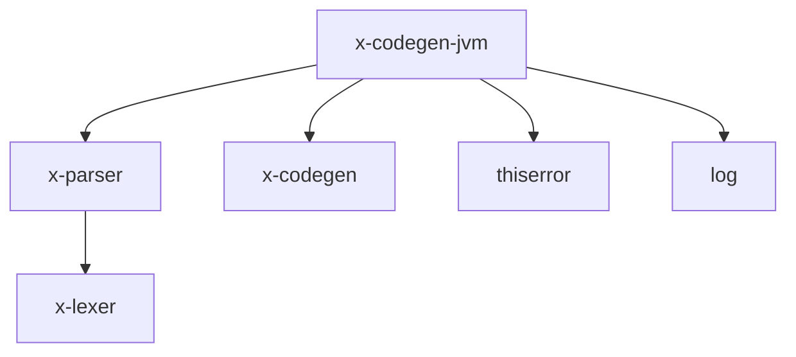

# CLAUDE.md

## 1. 功能定位

x-codegen-jvm 是 X 语言的 JVM（Java 虚拟机）后端代码生成器，目标是将 X 语言源代码编译为 Java 字节码或 Java 源代码，最终运行在 JVM 上。

### 主要功能
- 实现 x-codegen 的 CodeGenerator trait
- 提供 JvmCodeGenerator 和 JvmConfig 类型
- 接口定义完整，但实现为桩代码
- 准备支持从 X 语言编译到 JVM 字节码或 Java 源代码

## 2. 依赖关系



### 核心依赖
- **x-parser**: 解析器库，提供 AST 结构
- **x-codegen**: 代码生成公共接口和抽象层
- **thiserror**: 错误处理库，提供自定义错误类型支持
- **log**: 日志库，用于调试和性能分析

### 被依赖关系
- 可以被 x-codegen 直接集成使用
- 可被 x-cli 依赖，用于编译到 JVM 平台

## 3. 目录结构

```
x-codegen-jvm/
├── Cargo.toml              # 包配置文件
└── src/
    └── lib.rs              # 核心实现（当前为桩代码）
```

## 4. 核心接口与类型

### JvmCodeGenerator
```rust
pub struct JvmCodeGenerator {
    config: JvmConfig,
}
```

### JvmConfig
```rust
#[derive(Debug, Clone)]
pub struct JvmConfig {
    pub output_dir: Option<PathBuf>,
    pub optimize: bool,
    pub debug_info: bool,
}
```

### JvmCodeGenError
```rust
#[derive(thiserror::Error, Debug)]
pub enum JvmCodeGenError {
    #[error("代码生成错误: {0}")]
    GenerationError(String),
    #[error("未实现: {0}")]
    Unimplemented(String),
    #[error("IO错误: {0}")]
    IoError(#[from] std::io::Error),
}
```

## 5. 使用示例

### 直接使用 JvmCodeGenerator
```rust
use x_codegen_jvm::{JvmCodeGenerator, JvmConfig};
use x_parser::ast::Program;

fn generate_jvm_code(program: &Program) {
    let config = JvmConfig {
        output_dir: Some("/path/to/output".into()),
        optimize: false,
        debug_info: true,
    };

    let mut generator = JvmCodeGenerator::new(config);

    match generator.generate_from_ast(program) {
        Ok(output) => println!("代码生成成功，生成了 {} 个文件", output.files.len()),
        Err(e) => eprintln!("代码生成失败: {}", e),
    }
}
```

### 通过 x-codegen 使用
```rust
use x_codegen::{get_code_generator, Target, CodeGenConfig};

fn compile_to_jvm() {
    let config = CodeGenConfig {
        target: Target::Jvm,
        output_dir: Some("/path/to/output".into()),
        optimize: false,
        debug_info: true,
    };

    if let Ok(mut generator) = get_code_generator(Target::Jvm, config) {
        // 从 AST 生成代码
        // generator.generate_from_ast(program).unwrap();
    }
}
```

## 6. 设计特点与架构考量

### 模块化架构
x-codegen-jvm 采用了与其他 x-codegen 后端相同的架构，实现了 CodeGenerator trait，确保与其他后端的一致性。

### 可扩展的配置
JvmConfig 结构支持基本的编译选项（输出目录、优化级别、调试信息），为未来的功能扩展预留了空间。

### 错误处理
实现了完整的错误类型层次结构，支持错误传播和格式化。

## Testing & Verification

## 7. 开发与测试

### 构建
```bash
cd compiler/x-codegen-jvm
cargo build
```

### 测试
```bash
cd compiler/x-codegen-jvm
cargo test
```

### 覆盖率与分支覆盖率（目标：行覆盖率 100%，分支覆盖率 100%）

```bash
cd compiler
cargo llvm-cov -p x-codegen-jvm --tests --lcov --output-path target/coverage/x-codegen-jvm.lcov
```

### 集成测试
当前实现为桩代码，集成测试会失败。需要实现完整功能后再进行测试。

## 8. 当前状态与限制

### 架构完整度
- **接口设计**: ✅ 100%（完整）
- **架构设计**: ✅ 100%（完整）
- **依赖管理**: ✅ 100%（完整）

### 功能实现度
- **generate_from_ast**: ❌ 0%（桩实现，返回未实现错误）
- **generate_from_hir**: ❌ 0%（桩实现，返回未实现错误）
- **generate_from_pir**: ❌ 0%（桩实现，返回未实现错误）

### 未来计划
- 实现从 AST 到 Java 源代码的生成
- 实现从 AST 到 Java 字节码的直接生成（使用 ASM 等库）
- 添加对 X 语言特性到 JVM 字节码的完整映射
- 优化生成的代码性能
- 实现与其他 x-codegen 后端相同级别的成熟度

## 9. 注意事项

当前 x-codegen-jvm 是一个功能完善的架构框架，但实现细节为空。如果需要使用此后端，您需要：

1. 实现从 X 语言 AST 到 Java 源代码的转换
2. 实现字节码生成或集成现有的字节码生成库（如 ASM）
3. 实现 X 语言类型系统到 Java 类型系统的映射
4. 实现 X 语言特性到 JVM 字节码的映射
