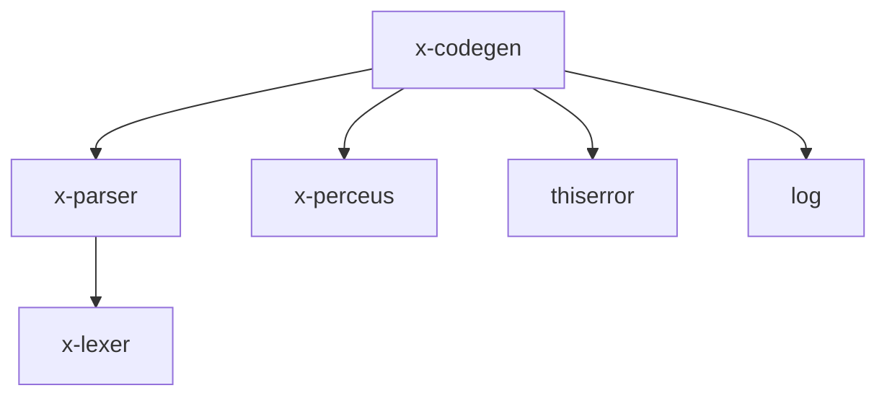

# CLAUDE.md

## 1. 功能定位

x-codegen 是 X 语言的核心代码生成器，提供多后端代码生成支持。它定义了统一的代码生成接口，并实现了多个目标平台的后端，包括 Zig（最成熟）、Python、Java、C# 和 TypeScript。

### 主要功能
- 统一的代码生成器接口（CodeGenerator trait）
- 从 AST 直接生成代码的初级接口
- 从 HIR 生成代码的高级接口
- 从 PerceusIR 生成代码的最终目标接口
- 支持多个目标平台后端
- 内置 Zig 后端（最成熟，支持 Native 和 Wasm）

## 2. 依赖关系



### 核心依赖
- **x-parser**: 解析器库，提供 AST 结构
- **x-perceus**: Perceus 内存管理库，提供 PerceusIR
- **thiserror**: 错误处理库，提供自定义错误类型支持
- **log**: 日志库，用于调试和性能分析

### 被依赖关系
- 被 x-cli 直接依赖，用于 compile 命令
- 是整个 X 语言编译器流水线的最终阶段

## 3. 目录结构

```
x-codegen/
├── Cargo.toml              # 包配置文件
└── src/
    ├── lib.rs              # 公共接口和抽象层
    ├── error.rs            # 错误类型定义
    ├── xir.rs              # X 语言中间表示（类 C 的 IR）
    ├── target.rs           # 目标平台和文件类型定义
    ├── lower.rs            # 降低阶段（未实现）
    ├── zig_backend.rs      # Zig 后端实现（最成熟）
    ├── python_backend.rs   # Python 后端实现
    ├── java_backend.rs     # Java 后端实现
    ├── csharp_backend.rs   # C# 后端实现
    ├── typescript_backend.rs # TypeScript 后端实现
    ├── compile_with_zig.rs # 与 Zig 编译器交互的二进制工具
    └── test_all_backends.rs # 多后端测试工具
```

## 4. 核心接口与类型

### CodeGenerator trait
```rust
pub trait CodeGenerator {
    type Config;
    type Error;

    fn new(config: Self::Config) -> Self;
    fn generate_from_ast(&mut self, program: &Program) -> Result<CodegenOutput, Self::Error>;
    fn generate_from_hir(&mut self, hir: &()) -> Result<CodegenOutput, Self::Error>;
    fn generate_from_pir(&mut self, pir: &()) -> Result<CodegenOutput, Self::Error>;
}
```

### CodeGenConfig
```rust
#[derive(Debug, PartialEq, Clone)]
pub struct CodeGenConfig {
    pub target: Target,
    pub output_dir: Option<PathBuf>,
    pub optimize: bool,
    pub debug_info: bool,
}
```

### Target 枚举
```rust
#[derive(Debug, PartialEq, Eq, Clone, Copy)]
pub enum Target {
    Native,      // 本地机器码（Zig）
    Wasm,        // WebAssembly（Zig）
    Jvm,         // Java 虚拟机
    DotNet,      // .NET 平台
    TypeScript,  // TypeScript
    Python,      // Python
}
```

### CodegenOutput
```rust
#[derive(Debug)]
pub struct CodegenOutput {
    pub files: Vec<OutputFile>,
    pub dependencies: Vec<String>,
}
```

## 5. 使用示例

### 获取代码生成器
```rust
use x_codegen::{get_code_generator, Target, CodeGenConfig};

fn main() {
    let config = CodeGenConfig {
        target: Target::Native,
        output_dir: Some("/path/to/output".into()),
        optimize: true,
        debug_info: false,
    };

    let mut generator = get_code_generator(Target::Native, config).unwrap();
    // 从 AST 生成代码
    // let output = generator.generate_from_ast(program).unwrap();
}
```

### 直接使用 Zig 后端
```rust
use x_codegen::zig_backend::{ZigBackend, ZigBackendConfig};

fn main() {
    let config = ZigBackendConfig {
        output_dir: Some("/path/to/output".into()),
        optimize: true,
        debug_info: false,
    };

    let mut backend = ZigBackend::new(config);
    // 从 AST 生成代码
    // let output = backend.generate_from_ast(program).unwrap();
}
```

## 6. 设计特点与架构考量

### 插件式后端架构
x-codegen 采用了灵活的插件式架构，允许添加新的后端而不修改核心代码。每个后端只需要实现 CodeGenerator trait 即可集成到系统中。

### 多阶段代码生成
支持三个级别的代码生成接口：
1. **从 AST 生成**：最简单但最不优化的方式
2. **从 HIR 生成**：高级优化方式
3. **从 PerceusIR 生成**：最终目标，支持 Perceus 内存管理

### 内置二进制工具
- **compile_with_zig.rs**：与 Zig 编译器交互，编译生成的 Zig 代码
- **test_all_backends.rs**：测试所有后端的一致性

## Testing & Verification

## 7. 开发与测试

### 构建
```bash
cd compiler/x-codegen
cargo build
```

### 测试
```bash
cd compiler/x-codegen
cargo test

# 运行特定后端的测试
cargo test -p x-codegen --test zig_backend
```

### 覆盖率与分支覆盖率（目标：行覆盖率 100%，分支覆盖率 100%）

```bash
cd compiler
cargo llvm-cov -p x-codegen --tests --lcov --output-path target/coverage/x-codegen.lcov
```

### 外部依赖（Zig）

`compile_with_zig` 以及 Zig 后端完整编译流程需要安装 Zig 并加入 PATH（见仓库根 `CLAUDE.md` 中的 Zig 说明）。

### 使用 compile_with_zig 工具
```bash
cd compiler/x-codegen
cargo run --bin compile_with_zig -- --help
```

### 运行所有后端测试
```bash
cd compiler/x-codegen
cargo run --bin test_all_backends
```

## 8. 各后端状态

| 后端 | 状态 | 描述 |
|------|------|------|
| Zig | ✅ 成熟 | 支持 Native 和 Wasm 目标，最成熟的后端 |
| Python | 🚧 开发中 | 基础功能已实现，但不完整 |
| Java | 🚧 开发中 | 仅有桩实现，需要完善 |
| C# | 🚧 开发中 | 仅有桩实现，需要完善 |
| TypeScript | 🚧 开发中 | 基础功能已实现，但不完整 |
