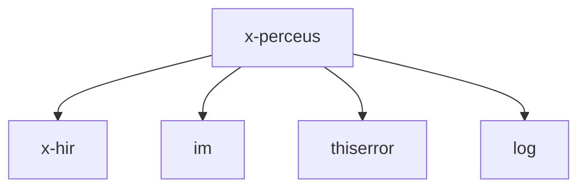

# CLAUDE.md

## 1. 功能定位

x-perceus 是 X 语言的 Perceus 内存管理库，实现了编译期内存分析（dup/drop、复用分析）功能。Perceus 是一种前沿的内存管理技术，通过编译期分析消除了传统垃圾回收的运行时开销，同时保留了内存安全性。

### 主要功能
- 对高级中间表示（HIR）进行 Perceus 分析
- 编译期内存复用分析
- 自动插入 dup/drop 操作
- 消除不必要的内存分配
- 支持 PerceusIR 中间表示

## 2. 依赖关系



### 核心依赖
- **x-hir**: X 语言高级中间表示
- **im**: 不可变数据结构库，用于安全的 AST 操作
- **thiserror**: 错误处理库，提供自定义错误类型支持
- **log**: 日志库，用于调试和性能分析

### 被依赖关系
- 被 x-codegen 依赖，用于从 PerceusIR 生成代码

## 3. 目录结构

```
x-perceus/
├── Cargo.toml          # 包配置文件
└── src/
    └── lib.rs          # 核心实现
```

## 4. 核心接口与类型

### PerceusIR
```rust
#[derive(Debug, PartialEq, Clone)]
pub struct PerceusIR {
    // Perceus中间表示的根结构
}
```

### 分析函数
```rust
/// 对高级中间表示进行Perceus分析
pub fn analyze_hir(_hir: &x_hir::Hir) -> Result<PerceusIR, PerceusError> {
    Ok(PerceusIR {})
}
```

### 错误类型
```rust
#[derive(thiserror::Error, Debug)]
pub enum PerceusError {
    #[error("分析错误: {0}")]
    AnalysisError(String),
}
```

## 5. 使用示例

```rust
use x_perceus::{analyze_hir, PerceusIR};
use x_hir::Hir;

fn run_perceus_analysis(hir: &Hir) -> Result<PerceusIR, Box<dyn Error>> {
    let pir = analyze_hir(hir)?;
    println!("Perceus分析完成");
    Ok(pir)
}
```

## 6. 设计特点与架构考量

### Perceus 内存管理原理
Perceus 通过跟踪变量的生命周期和使用模式，在编译期确定何时需要复制（dup）、何时需要释放（drop）内存。这种方法消除了运行时垃圾回收的开销，同时提供了内存安全保证。

### 架构设计
- 简洁的 API 设计，只暴露核心分析功能
- 与 HIR 解耦，便于后续扩展
- 错误处理使用 thiserror 库，提供友好的错误信息
- 内部使用不可变数据结构，确保线程安全

## Testing & Verification

## 7. 开发与测试

### 构建
```bash
cd compiler/x-perceus
cargo build
```

### 测试
```bash
cd compiler/x-perceus
cargo test
```

### 覆盖率与分支覆盖率（目标：行覆盖率 100%，分支覆盖率 100%）

推荐使用 `cargo llvm-cov` 生成 **line/branch** 覆盖率报告。

```bash
cd compiler
cargo llvm-cov -p x-perceus --tests --lcov --output-path target/coverage/x-perceus.lcov
```

### 集成测试
x-perceus 的功能通常通过 x-codegen 进行集成测试，验证从 HIR 到目标代码的完整流程。
